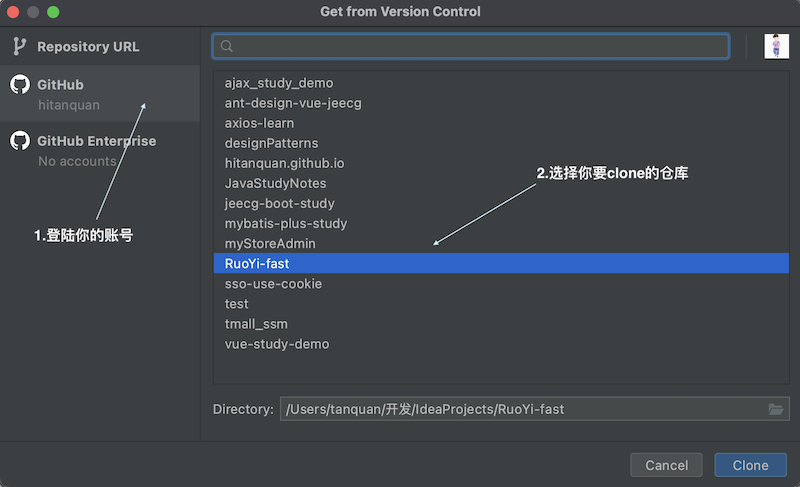

#### 搭建过程和步骤

* 首先在你的GitHub （[点我跳转到项目仓库](https://github.com/hitanquan/RuoYi-fast) ）上创建一个空白仓库，这个很简单，就不详细介绍了。

* 然后将你项目仓库的链接地址拷贝，在idea中通过从版本控制系统拷贝的方式把项目clone到你的idea中，当然了，如果你在idea中登录了你的GitHub账号，这样的话
就不用拷贝链接了，直接找到你创建的仓库clone即可。如下图：

* 因为一开始创建的仓库并没有像idea创建项目一样为我们创建好目录结构，所以需要自己创建项目结构，主要有src源码和resource资源目录以及它们的子目录。

* 搭建好项目结构后再创建pom文件，并将所需的项目依赖，如SpringBoot启动器、lombok等引入进来，这个时候可能idea并没有识别出这是个maven项目，所以需要自己
手动把maven窗口调出来并手动将项目依赖引入进来。可参考博客：[寻找maven窗口](https://blog.csdn.net/qq_41934719/article/details/85214861)

* 最后就是创建项目启动类，即本项目中的MyRuoYiApplication类，这个是SpringBoot项目的启动类，代码也很简单，就不贴代码了。到此一个SpringBoot应用的框架就搭建好了，
为了能看到页面，可以在resource目录下新建一个存放html静态页面的目录，并新建一个html文件，填写一些信息，然后重启项目在浏览器中访问即可。
（默认访问地址为：http://localhost:8080/xxx.html）。

     
     

